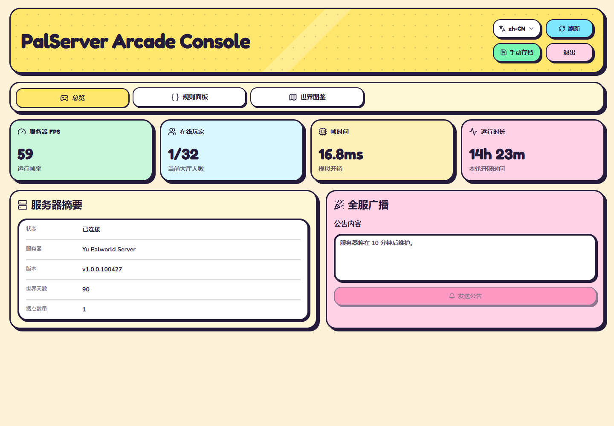
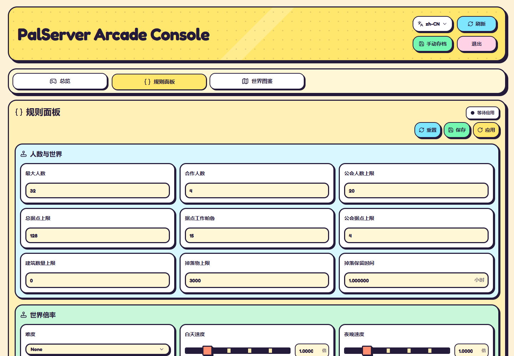
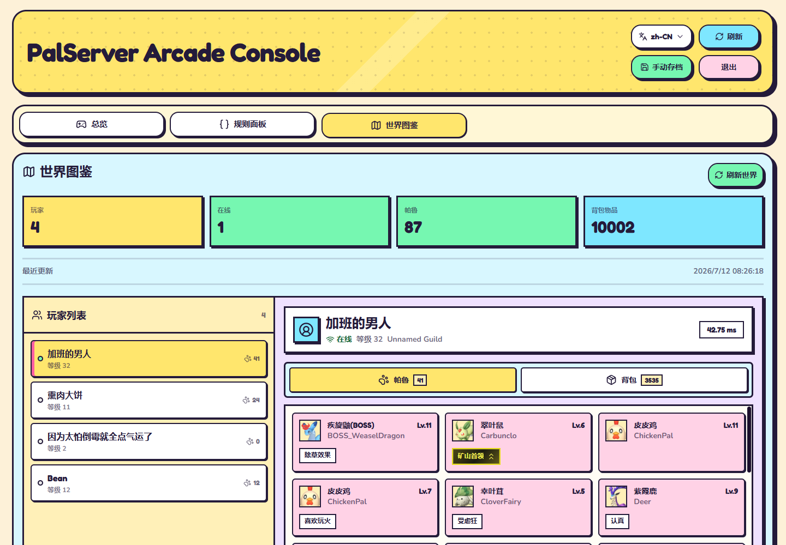
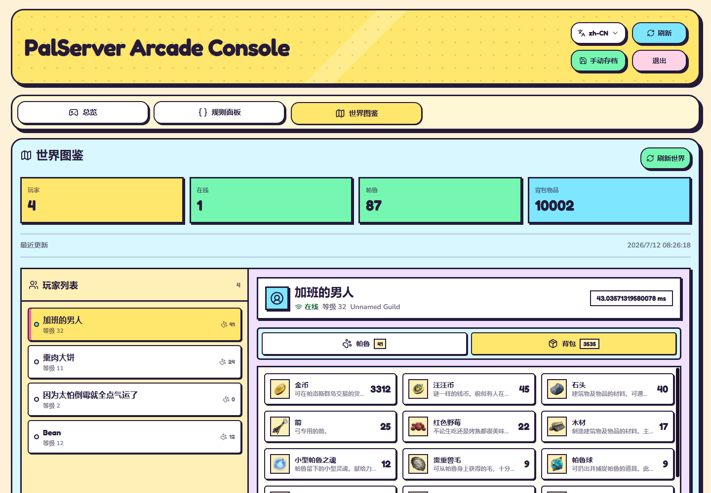

# PalServer Arcade Console

> 仲間内の Palworld サーバー向けアーケード風コンソール。

[简体中文](README.zh-CN.md) | [English](README.en.md) | [ホームへ戻る](../README.md)

`PalServer Arcade Console` は、Palworld 専用サーバー向けの軽量 WebUI です。Docker で動作し、WebUI と Palworld サーバーを別コンテナとして同じ Linux サーバー上に配置する構成に向いています。

本プロジェクトは Palworld 1.0 に対応しています。公開サーバー運営用の管理基盤ではなく、友人同士で遊ぶプライベートサーバー向けの自用パネルです。そのため、プレイヤー操作、キック、BAN、BAN 解除などの管理機能は組み込んでいません。必要な場合は、このプロジェクトをベースに二次開発してください。

## Start Screen

| 項目 | 内容 |
| --- | --- |
| ゲームバージョン | Palworld 1.0 対応 |
| デプロイ方式 | Docker Compose |
| 利用シーン | 仲間内サーバー、自用管理、軽量メンテナンス |
| 主な機能 | 状態概要、手動セーブ、ルールパネル、ワールド図鑑、資源マップ |
| 安全境界 | ワールド図鑑は `Level.sav` を読み取り専用で解析し、セーブデータへ書き戻しません |

## Preview

以下のスクリーンショットは実際のデプロイ環境から取得したもので、ダッシュボード、ルール設定、ワールド図鑑の見た目を確認できます。

### 概要



### ルールパネル



### ワールド図鑑：パル



### ワールド図鑑：バッグと装備



## Feature Menu

- ログイン保護：WebUI のユーザー名とパスワードでコンソールに入ります。
- サーバー概要：接続状態、オンライン人数、バージョン、FPS、フレーム時間、稼働時間を表示します。
- 手動セーブ：Palworld に即時ワールド保存を要求します。
- 全体ブロードキャスト：オンラインプレイヤーへ告知を送信します。
- ルールパネル：`PalWorldSettings.ini` の主要設定を読み取り、保存し、適用します。
- ワールド図鑑：手動セーブ後に `Level.sav` を読み取り、プレイヤー、パル、拠点、ギルド、世界統計を表示します。
- 資源マップ：PalDB のマーカーデータをもとにパルパゴス諸島と世界樹の資源点を表示し、カテゴリ絞り込み、検索、オンラインプレイヤー位置、拠点位置を確認できます。
- バッグ読み取り：プレイヤー個別セーブを読み取り専用で読み、所持品を集計します。
- ローカルキャッシュ：生成済みワールドデータを WebUI 側に保存し、画面表示のたびにセーブを再解析しません。

未搭載：プレイヤー操作、キック、BAN、BAN 解除。このプロジェクトは公開サーバー管理ツールというより、友人サーバー用のアーケードパネルです。

## Insert Coin：デプロイ前の準備

Palworld の REST API を有効化し、Palworld コンテナを再起動してください。

```ini
RESTAPIEnabled=True
RESTAPIPort=8212
AdminPassword="Palworld の管理者パスワード"
```

次にサーバー上の情報を確認します。

```bash
docker ps --format 'table {{.Names}}\t{{.Ports}}'
find /opt/1panel/apps/palworld/palworld/data/SaveGames/0 -name Level.sav -printf '%h\n'
```

必要な値：

- Palworld コンテナ名
- REST API の公開ポート
- `PalWorldSettings.ini` のホスト側パス
- `Level.sav` を含むワールドディレクトリ
- プレイヤー個別セーブの `Players` ディレクトリ

## DIP Switch：環境設定

デプロイディレクトリで設定ファイルを作成します。

```bash
cp .env.example .env
```

編集するのはルートの `.env` だけです。WebUI ログイン、Palworld REST API、コンテナ名、ホスト側ファイルパスをここに集約します。

```env
WEBUI_PORT=18080

WEBUI_USER=admin
WEBUI_PASSWORD=WebUI のログインパスワードに変更
WEBUI_SESSION_SECRET=十分に長いランダム文字列に変更

PALWORLD_API_URL=http://host.docker.internal:8212/v1/api
PALWORLD_API_USER=admin
PALWORLD_API_PASSWORD=PalWorldSettings.ini の AdminPassword を入力
PALWORLD_DOCKER_CONTAINER=1Panel-palworld-okSH

PALWORLD_SETTINGS_HOST_PATH=/opt/1panel/apps/palworld/palworld/data/Config/LinuxServer/PalWorldSettings.ini
PALWORLD_WORLD_SAVE_HOST_PATH=/opt/1panel/apps/palworld/palworld/data/SaveGames/0/<world-id>/Level.sav
PALWORLD_PLAYER_SAVES_HOST_PATH=/opt/1panel/apps/palworld/palworld/data/SaveGames/0/<world-id>/Players
```

`WEBUI_SESSION_SECRET` は次のコマンドで生成できます。

```bash
openssl rand -hex 32
```

サーバーから Alpine 公式ミラーへの接続が遅い場合は、`.env` に次を設定できます。

```env
ALPINE_MIRROR=https://mirrors.aliyun.com/alpine
```

空欄の場合は公式ミラーを使います。

## Cabinet Wiring：Docker Compose

プロジェクトには `compose.yaml` が含まれています。`.env` に正しいホストパスとワールド ID を設定した後、マウント関係を確認してください。

```yaml
services:
  palserver-gui:
    build: .
    container_name: palserver-gui
    restart: unless-stopped
    ports:
      - "${WEBUI_PORT:-3000}:3000"
    env_file:
      - .env
    extra_hosts:
      - "host.docker.internal:host-gateway"
    volumes:
      - ./data:/app/data
      - /var/run/docker.sock:/var/run/docker.sock
      - ${PALWORLD_SETTINGS_HOST_PATH}:/app/palworld/PalWorldSettings.ini
      - ${PALWORLD_WORLD_SAVE_HOST_PATH}:/app/world/Level.sav:ro
      - ${PALWORLD_PLAYER_SAVES_HOST_PATH:-./empty-players}:/app/world/Players:ro
```

| マウント | 用途 |
| --- | --- |
| `./data:/app/data` | ワールド図鑑キャッシュの永続化 |
| `/var/run/docker.sock` | ルール適用時の Palworld コンテナ再起動 |
| `PalWorldSettings.ini` | ルールパネルの読み書き |
| `Level.sav:ro` | ワールド図鑑の読み取り専用解析 |
| `Players:ro` | プレイヤー所持品の読み取り専用解析 |

ルール適用後のコンテナ再起動が不要な場合、Docker Socket マウントは削除できます。ルール保存とワールド図鑑は Docker Socket に依存しません。

## Press Start：起動とアクセス

```bash
docker compose up -d --build
docker compose logs -f palserver-gui
```

アクセス先：

```text
http://SERVER_IP:WEBUI_PORT
```

例：`.env` で `WEBUI_PORT=18080` を設定した場合、`http://SERVER_IP:18080` を開きます。

## Control Guide：操作

### 概要

- `更新`：現在のサーバー状態を読み取ります。
- `手動セーブ`：Palworld に即時保存を要求します。
- `ブロードキャスト`：オンラインプレイヤーへ告知を送信します。

### ルールパネル

- `リセット`：今回読み取った設定値に戻します。
- `保存`：`PalWorldSettings.ini` に書き込みます。サーバーは再起動しません。
- `適用`：保存後、`.env` の `PALWORLD_DOCKER_CONTAINER` で指定したコンテナを再起動します。オンラインプレイヤーがいる場合は確認が入ります。

### ワールド図鑑

`ワールド更新` を押すと、WebUI は先に Palworld へ保存を要求し、その後読み取り専用でマウントされた `Level.sav` を解析してキャッシュを生成します。通常表示時はキャッシュを読み、継続的にセーブデータを解析しません。

ワールド図鑑の内容：

- プレイヤー一覧
- オンライン状態
- プレイヤー所有パル
- プレイヤー所持品
- 拠点、ギルド、世界統計

## Troubleshooting

### REST API に接続できない

WebUI コンテナ内で Palworld を指すために `127.0.0.1` を使わないでください。REST API をホストへ公開している場合は、次の設定を使います。

```env
PALWORLD_API_URL=http://host.docker.internal:8212/v1/api
```

Compose 側にも次を残してください。

```yaml
extra_hosts:
  - "host.docker.internal:host-gateway"
```

Palworld が `8212/tcp` をホストへ公開していない場合は、Palworld 側の Compose 設定にポートマッピングを追加し、コンテナを再作成してください。

### ワールド図鑑がセーブファイルを見つけられない

`find` コマンドで見つけた実際のディレクトリを確認し、`.env` の `PALWORLD_WORLD_SAVE_HOST_PATH` が同じ `Level.sav` を指していることを確認してください。

### ワールド図鑑に所持品が表示されない

`.env` の `PALWORLD_PLAYER_SAVES_HOST_PATH` が同じワールドディレクトリ内の `Players` フォルダを指しているか確認してください。未設定でもプレイヤーとパルは表示できますが、所持品は表示されません。

### ルール適用でサーバーを再起動できない

WebUI コンテナ内から Palworld コンテナが見えるか確認します。

```bash
docker exec palserver-gui docker ps --format '{{.Names}}'
```

出力には `.env` の `PALWORLD_DOCKER_CONTAINER` で設定したコンテナ名が含まれている必要があります。

## Continue：更新

```bash
docker compose down
docker compose build --no-cache palserver-gui
docker compose up -d --force-recreate palserver-gui
```

アップグレード前に `.env` と `data/` を残してください。`.env`、`data/`、`Level.sav` はリポジトリへコミットしないでください。
